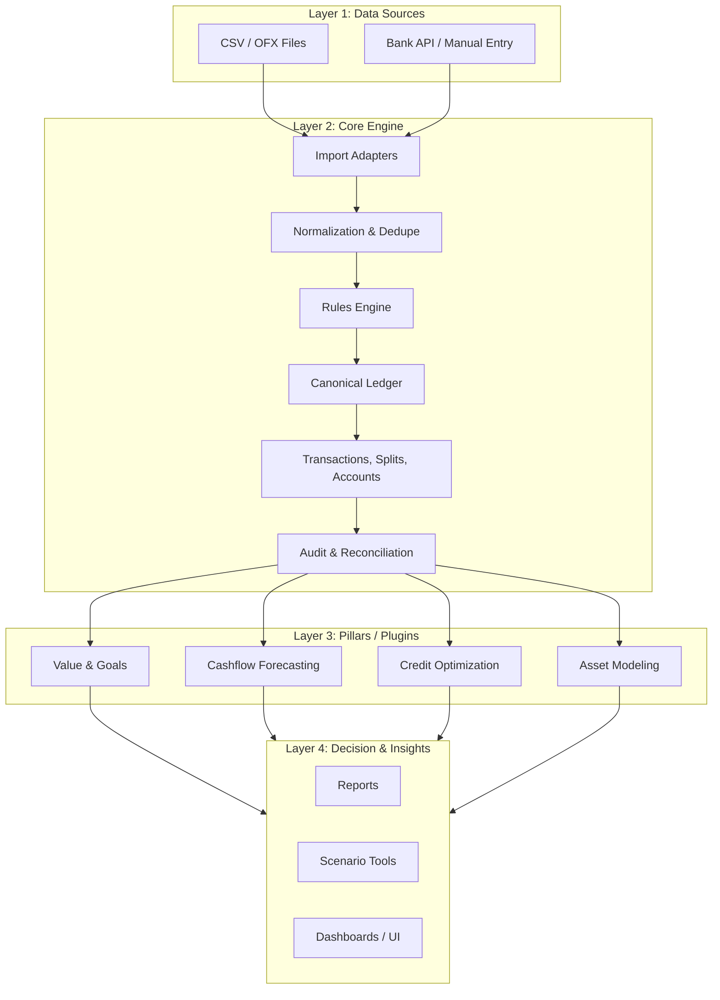

# Architecture Overview

Align is structured as a modular, extensible financial modeling system. Its core responsibility is to maintain a consistent and highly detailed record of transactions, while its plugin architecture allows for expansion into analytics, forecasting, asset modeling, and credit optimization.

This document provides an overview of:

* System architecture (conceptual + technical)
* Core engine design
* Plugin architecture
* Data flow through the system
* Future evolution plans

---

# 1. Architectural Philosophy

Align is designed around four long-term architectural principles, with a strong emphasis on **future evolution**, **scalability**, and **sustainable growth**.

## 1. Modularity as a Long-Term Strategy

Each major capability (expense tracking, forecasting, credit optimization, asset modeling, value analytics) is built as a separate module or "pillar." These modules are intentionally decoupled so that they can evolve independently. This allows Align to grow over time without forcing a redesign of the entire system.

## 2. A Stable, Forward-Compatible Core

The core engine provides:

* A canonical financial ledger
* Stable entity definitions
* Predictable import and normalization behavior
* Durable audit and reconciliation processes

This stability ensures that future modules—whether built by you or external contributors—can rely on a dependable foundation.

## 3. Extensibility Through Versioned Interfaces

Pillars interact with the core through explicit, versioned APIs. This design allows:

* Safe evolution over time
* Deprecation paths for older plugin versions
* New capabilities without breaking existing modules
* Potential migration to service-based or distributed patterns later

## 4. Designed for Evolution and Extraction

While Align starts as a monolithic codebase, this simply means the system initially lives in one cohesive codebase and runtime environment. In this context, “monolithic” does **not** imply rigidity or tightly coupled internals. Instead, it reflects a deliberate choice for early-stage clarity, faster development, and predictable behavior. The architecture is intentionally structured so that internal boundaries remain clean, explicit, and modular — enabling future extraction of pillars into separate deployable services without major refactoring. Over time, individual pillars (such as forecasting or asset modeling) can be extracted into their own deployable services without major refactoring.

This forward-flexible design prepares Align for future directions such as:

* Event-sourced ledger reconstruction
* Distributed plugin execution
* Multi-tenant deployments
* Scenario simulation engines
* Third-party plugin marketplaces

---

# 2. High-Level System Structure

Align is composed of two major layers:

```
align_core/   --> Canonical ledger, rules, imports, accounts, database, API
align_plugins/ --> Optional or replaceable analytics modules ("pillars")
```

## Core Responsibilities

* Transaction ledger
* Split support
* Categories, tags, merchants
* Recurring transaction engine
* Import → normalize → dedupe → rule-apply
* Audit logging
* Exposing canonical APIs to plugins and UI

## Plugin Responsibilities

Each plugin focuses on a domain-specific capability:

* Value Analytics
* Cash Flow Forecasting
* Credit Optimization
* Asset Modeling

---

# 3. Architecture Diagram (Mermaid)



---

# 4. Core Engine Details

The core is responsible for:

## 4.1. Canonical Data Model

Defines the primary entities:

* `transactions`
* `transaction_splits`
* `accounts`
* `categories`
* `tags`
* `merchants`
* `recurring_templates`
* `mileage_entries`
* `audit_logs`

See `docs/data-model.md` for full details.

## 4.2. Import Pipeline

```
CSV / OFX / API → Normalize → Deduplicate → Apply Rules → Commit → Trigger Plugin Hooks
```

## 4.3. Rules Engine

Supports:

* Auto-categorization
* Auto-tagging
* Auto-splitting
* Merchant normalization
* Priority-based rule execution
* Historical reapplication

## 4.4. Recurring Engine

Handles:

* Monthly/quarterly/annual charges
* Dual-trigger conditions for assets
* Replacement schedules (future)

---

# 5. Plugin Architecture

Plugins are standalone modules under `align_plugins/`.

A plugin can:

## 5.1. Subscribe to events

* `on_import(transaction)`
* `on_update(transaction)`
* `on_delete(transaction)`
* Scheduled events (daily/weekly/monthly)

## 5.2. Read from the Core

Plugins can access:

* Canonical tables
* APIs
* Normalized merchant data
* Tags and categories
* Account histories

## 5.3. Write Derived Data

Plugins can add:

* Metrics
* Forecast outputs
* Reward analyses
* Asset maintenance predictions

These live in plugin-owned tables to preserve independence.

## 5.4. Add Interfaces

Plugins may expose:

* REST endpoints
* CLI tools
* Reports
* UI components (future)

---

# 6. Data Flow Through the System

## Step 1 — Import

Sources:

* CSV
* Bank API
* Manual entry

Core normalizes and commits transactions.

## Step 2 — Rules Execution

Rules categorize, tag, and optionally split transactions.

## Step 3 — Plugin Hooks

Plugins analyze:

* Value metrics
* Credit card rewards
* Forecast impacts
* Asset-related costs

## Step 4 — Derived Output

Plugin-written data goes to:

* `value_metrics`
* `cashflow_projection`
* `reward_estimates`
* `asset_costs`

## Step 5 — Decision Layer

Frontend/UI/CLI queries the combined outputs.

---

# 7. Future Evolution

Align is built to evolve without major refactoring.

## Planned Evolutions

* Optional microservice extraction
* Event-sourced ledger
* Plugin marketplace
* Multi-tenant support
* Scenario simulator UI
* Policy-based automation rules

---

# 8. File Structure Reference

```
align/
├── align_core/       # Canonical engine
├── align_plugins/    # Modular pillars
├── docs/             # Documentation
└── examples/         # Use cases and demos
```

---

# 9. Related Documents

* `docs/data-model.md`
* `docs/plugin-api.md`
* `docs/forecasting-spec.md`
* `docs/credit-spec.md`
* `docs/asset-model.md`
* `docs/roadmap.md`
