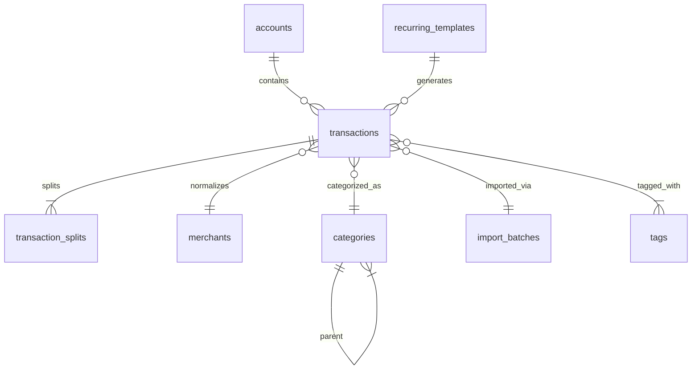

# Data Model Overview

This document describes the canonical data model for **Align**. It defines the core entities, their relationships, naming conventions, and design philosophy. The data model is intentionally stable—all pillars and plugins rely on it as the single source of truth.

This model is high-level. Implementation-level details (SQL DDL, migrations, edge-case constraints) will be documented per-feature.

---

# 1. Design Philosophy

The Align data model follows four guiding principles:

## 1.1 Single Source of Truth

All financial information—expenses, income, transfers, splits, tags, categories—flows into one canonical ledger. This ensures consistency across forecasting, value analytics, credit optimization, and asset modeling.

## 1.2 Normalized but Practical

The schema avoids excessive redundancy, but denormalization is allowed for:

* performance-critical summaries
* monthly aggregates
* projections

These appear in plugin-owned tables, never in the core ledger.

## 1.3 Extensible

New plugins must be able to add:

* derived tables
* supplemental relationships
* customized metrics

Without modifying the core database structure.

## 1.4 Traceable & Auditable

Every meaningful change is logged with:

* before/after snapshots
* user ID
* timestamp

Auditability is central to system trust.

---

# 2. Core Entities

The following entities make up the canonical ledger. Names may evolve slightly in implementation but their roles are fixed.

## 2.1 `transactions`

Represents any financial event.

**Fields** (high-level):

* `id` (uuid)
* `user_id` (uuid)
* `account_id` (fk)
* `external_id` (string, for import dedupe)
* `posted_date` (date)
* `transaction_date` (date)
* `amount` (decimal, negative=expense, positive=income)
* `currency` (string)
* `merchant_name_raw` (string)
* `merchant_normalized_id` (fk)
* `category_id` (fk, nullable)
* `tags` (json/array)
* `status` (pending/cleared/reconciled)
* `import_batch_id` (fk)
* `notes` (text)
* `created_at`, `updated_at`

**Purpose:** The heart of Align.

---

## 2.2 `transaction_splits`

Represents subcomponents of a transaction.

**Fields:**

* `id`
* `transaction_id` (fk)
* `amount` (decimal)
* `category_id` (fk)
* `tags` (json/array)
* `memo` (string)

**Rules:**

* Sum of splits must equal parent transaction amount.

---

## 2.3 `accounts`

Represents bank, credit, cash, investment, or other financial accounts.

**Fields:**

* `id`
* `user_id`
* `name`
* `type` (checking, savings, credit, loan, cash, investment, etc.)
* `institution_name`
* `currency`
* `balance_cached` (optional performance optimization)
* `balance_as_of`
* `last_synced_at`
* `metadata` (json object for sync configuration or notes)

**Purpose:**

* The authoritative list of accounts the user interacts with.
* Used for balance tracking, forecasting, credit analysis, and account‑level reporting.

---

## 2.4 `categories`

Hierarchical category system.

**Fields:**

* `id`
* `name`
* `parent_id` (nullable)
* `type` (expense, income, transfer)
* `default_taxable` (bool)

---

## 2.5 `tags`

Flexible, user-defined labels.

**Fields:**

* `id`
* `name`
* `description`
* `color`

Example: `for_others`

---

## 2.6 `merchants`

Normalized merchant table.

**Fields:**

* `id`
* `normalized_name`
* `aliases` (array)
* `category_suggestion_id` (fk)
* `confidence_score`

---

## 2.7 `recurring_templates`

Defines recurring or expected future expenses.

**Fields:**

* `id`
* `user_id`
* `template_data` (json representation of a txn)
* `frequency_rule` (cron-style or custom frequency)
* `next_run_date`
* `end_date`
* `amount` (nullable if pattern-based)

---

## 2.8 (Reserved for Future Extensions)

This slot previously referenced asset‑specific tables such as `vehicles` or `mileage_entries`. These **do not belong to the core data model** and have been intentionally removed.

Asset‑related entities will be fully defined in:

* `docs/asset-model.md`

The core ledger remains asset‑agnostic.

---

## 2.9 `audit_logs`

Stores before/after snapshots for transparency.

**Fields:**

* `id`
* `entity_type`
* `entity_id`
* `action`
* `before` (json)
* `after` (json)
* `timestamp`
* `user_id`

---

# 3. Supplemental Entities

Entities that support advanced features but do not belong to the strict core ledger. Asset‑related entities have been intentionally moved to their own pillar specifications (e.g., `asset-model.md`).

## 3.1 `payment_methods`

Represents credit cards or other payment instruments used for transactions.

**Fields:**

* `id`
* `user_id`
* `account_id` (fk)
* `network` (Visa, Mastercard, etc.)
* `last4`
* `is_active`
* `rewards_profile_id` (for credit optimization)

---

Cards or payment instruments.

## 3.2 `import_batches`

Track metadata for each import.

## 3.3 `fx_rates`

Used only if multi-currency support is enabled.

---

# 4. Relationships Overview (Mermaid ERD)

---

# 5. Naming Conventions

* Tables: `snake_case_plural` (e.g., `transaction_splits`)
* Columns: `snake_case`
* Foreign Keys: `<entity>_id`
* Timestamps: `created_at`, `updated_at`
* Status fields: enums or constrained text

---

# 6. Future Extensions

The data model is intentionally extensible. Future additions may include:

* `installment_plans`
* `budget_targets`
* `scenario_runs`
* `behavior_annotations`
* `vendor_profiles`

---

# 7. Related Documents

* `docs/architecture.md`
* `docs/plugin-api.md`
* `docs/forecasting-spec.md`
* `docs/credit-spec.md`
* `docs/asset-model.md`
* `docs/roadmap.md`
